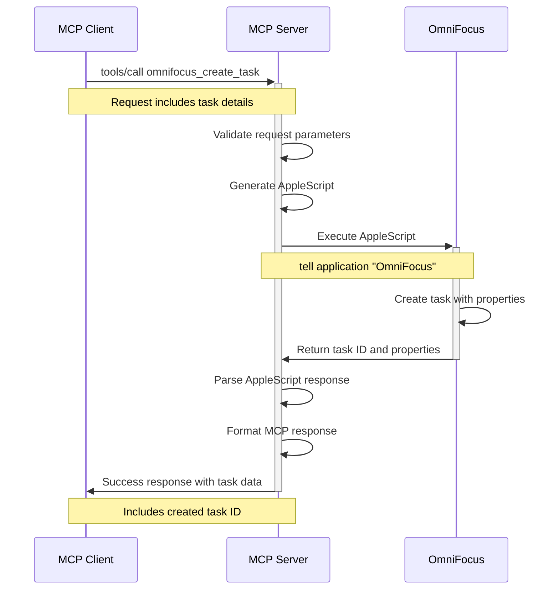
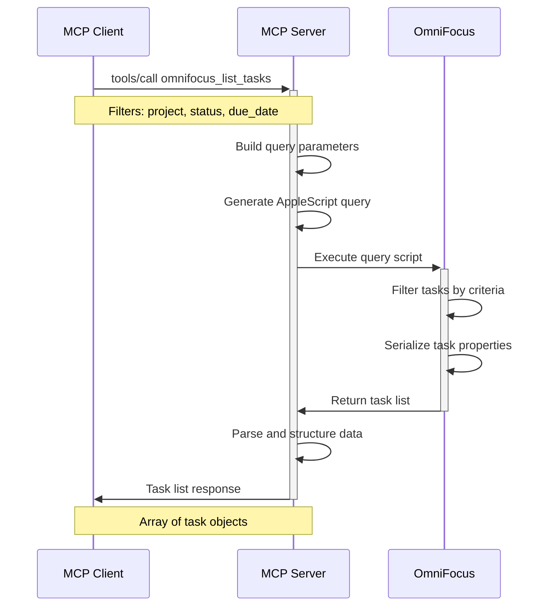

# MCP-OmniFocus Integration: High-Level Architecture and Data Flow

## Overview

This document defines the high-level architecture for integrating OmniFocus with the Model Context Protocol (MCP) system, including data structures, sequence diagrams, and comprehensive error-handling strategies.

## System Architecture

### Component Overview

```
┌─────────────────────┐    ┌─────────────────────┐    ┌─────────────────────┐
│                     │    │                     │    │                     │
│   MCP Client        │    │   AppleScript MCP   │    │   OmniFocus 4       │
│   (Claude, etc.)    │◄──►│   Server            │◄──►│   Application       │
│                     │    │                     │    │                     │
└─────────────────────┘    └─────────────────────┘    └─────────────────────┘
          │                          │                          │
          │                          │                          │
          ▼                          ▼                          ▼
┌─────────────────────┐    ┌─────────────────────┐    ┌─────────────────────┐
│                     │    │                     │    │                     │
│   MCP Protocol      │    │   OmniFocus         │    │   AppleScript       │
│   (JSON-RPC)        │    │   Integration       │    │   Engine            │
│                     │    │   Category          │    │                     │
└─────────────────────┘    └─────────────────────┘    └─────────────────────┘
```

### Core Components

1. **MCP Client Layer**
   - External clients (Claude, IDEs, etc.)
   - Sends MCP protocol requests
   - Receives structured responses

2. **AppleScript MCP Server**
   - Existing framework extended with OmniFocus capabilities
   - Protocol translation (MCP ↔ AppleScript)
   - Error handling and logging

3. **OmniFocus Integration Category**
   - New category module (`src/categories/omnifocus.ts`)
   - Script definitions for OmniFocus operations
   - Data validation and transformation

4. **OmniFocus Application**
   - Target application for automation
   - AppleScript dictionary interface
   - Document and data persistence

## Data Structures and Exchanges

### MCP Tool Request Schema

```json
{
  "jsonrpc": "2.0",
  "id": "request-id",
  "method": "tools/call",
  "params": {
    "name": "omnifocus_create_task",
    "arguments": {
      "name": "Task name",
      "note": "Task description",
      "project": "Project name or ID",
      "tag": "Context tag",
      "dueDate": "2024-12-31T23:59:59Z",
      "deferDate": "2024-12-01T09:00:00Z",
      "flagged": true,
      "estimatedMinutes": 60
    }
  }
}
```

### OmniFocus Data Models

#### Task Record Structure
```typescript
interface OmniFocusTask {
  id: string;                    // Unique identifier
  name: string;                  // Task name
  note?: string;                 // Task description
  containingProject?: string;    // Project ID or name
  primaryTag?: string;           // Main context tag
  flagged: boolean;             // Flag status
  completed: boolean;           // Completion status
  dropped: boolean;             // Dropped status
  blocked: boolean;             // Dependency blocking
  next: boolean;                // Next action status
  inInbox: boolean;             // Inbox status
  creationDate: Date;           // Creation timestamp
  modificationDate: Date;       // Last modified
  dueDate?: Date;               // Due date
  deferDate?: Date;             // Defer/start date
  completionDate?: Date;        // Completion timestamp
  estimatedMinutes?: number;    // Time estimate
  repetitionRule?: RepetitionRule;
}
```

#### Project Record Structure
```typescript
interface OmniFocusProject {
  id: string;
  name: string;
  note?: string;
  status: 'active' | 'on_hold' | 'done' | 'dropped';
  sequential: boolean;          // Sequential vs parallel
  completedByChildren: boolean; // Auto-completion setting
  rootTask?: string;           // Root task ID
  nextTask?: string;           // Next actionable task ID
  folder?: string;             // Containing folder
  creationDate: Date;
  modificationDate: Date;
  dueDate?: Date;
  deferDate?: Date;
  completionDate?: Date;
  reviewInterval?: string;      // Review frequency
  lastReviewDate?: Date;
  nextReviewDate?: Date;
  repetitionRule?: RepetitionRule;
}
```

#### Tag Record Structure
```typescript
interface OmniFocusTag {
  id: string;
  name: string;
  note?: string;
  container?: string;           // Parent tag ID
  allowsNextAction: boolean;
  hidden: boolean;
  availableTaskCount: number;
  remainingTaskCount: number;
  location?: LocationInfo;
}
```

#### Supporting Types
```typescript
interface RepetitionRule {
  method: 'fixed' | 'start_after_completion' | 'due_after_completion';
  interval: number;
  unit: 'minute' | 'hour' | 'day' | 'week' | 'month' | 'year';
}

interface LocationInfo {
  latitude: number;
  longitude: number;
  altitude?: number;
  radius?: number;
  trigger?: 'notify_arriving' | 'notify_leaving';
}
```

### Error Response Structure
```json
{
  "jsonrpc": "2.0",
  "id": "request-id",
  "error": {
    "code": -32001,
    "message": "OmniFocus operation failed",
    "data": {
      "error_type": "applescript_error",
      "applescript_error": "Can't get object.",
      "context": {
        "operation": "create_task",
        "target_project": "Non-existent Project"
      },
      "retry_strategy": "manual",
      "recovery_suggestions": [
        "Verify project exists",
        "Check project name spelling",
        "Use project ID instead of name"
      ]
    }
  }
}
```

## Sequence Diagrams

### 1. Successful Task Creation Flow



### 2. Task Query with Filtering



### 3. Bidirectional Sync Process

```mermaid
sequenceDiagram
    participant Client as MCP Client
    participant Server as MCP Server
    participant OF as OmniFocus
    participant Cache as Local Cache
    
    Client->>+Server: tools/call omnifocus_sync
    
    Server->>+Cache: Get last sync timestamp
    Cache->>-Server: Return timestamp
    
    Server->>+OF: Query modified tasks since timestamp
    OF->>-Server: Return changed tasks
    
    Server->>+Cache: Compare with cached data
    Cache->>-Server: Return conflicts/changes
    
    alt No Conflicts
        Server->>OF: Apply pending MCP changes
        Server->>Cache: Update cache
        Server->>-Client: Sync success
    else Conflicts Detected
        Server->>-Client: Conflict resolution required
        Note over Client,Server: Includes conflict details
    end
```

### 4. Error Handling and Recovery

```mermaid
sequenceDiagram
    participant Client as MCP Client
    participant Server as MCP Server
    participant OF as OmniFocus
    
    Client->>+Server: tools/call omnifocus_create_project
    
    Server->>+OF: Execute AppleScript
    OF->>OF: Attempt project creation
    OF->>-Server: AppleScript error
    Note over OF,Server: "Can't make new project"
    
    Server->>Server: Parse error details
    Server->>Server: Determine error category
    
    alt Retryable Error
        Server->>+OF: Retry with modified parameters
        OF->>-Server: Success or different error
        Server->>-Client: Final result
    else Non-retryable Error
        Server->>Server: Log error context
        Server->>-Client: Structured error response
        Note over Client,Server: Includes recovery suggestions
    end
```

## Error Handling Strategies

### Error Categories and Responses

#### 1. Application State Errors
- **OmniFocus Not Running**: Auto-launch with confirmation
- **Document Not Available**: Wait and retry with exponential backoff
- **Sync in Progress**: Queue operation for after sync completion

```typescript
enum ErrorCategory {
  APPLICATION_STATE = 'application_state',
  PERMISSION_DENIED = 'permission_denied',
  INVALID_PARAMETERS = 'invalid_parameters',
  RESOURCE_NOT_FOUND = 'resource_not_found',
  OPERATION_FAILED = 'operation_failed',
  TIMEOUT = 'timeout'
}

interface ErrorContext {
  category: ErrorCategory;
  retryable: boolean;
  retryStrategy: 'immediate' | 'exponential_backoff' | 'manual';
  maxRetries: number;
  recoverySuggestions: string[];
  context: Record<string, any>;
}
```

#### 2. AppleScript Execution Errors
- **Syntax Errors**: Development-time validation
- **Permission Errors**: User guidance for system permissions
- **Runtime Errors**: Graceful degradation with user feedback

#### 3. Data Validation Errors
- **Invalid Dates**: Format correction and user notification
- **Missing Required Fields**: Clear parameter requirements
- **Reference Errors**: Suggest valid alternatives

### Recovery Mechanisms

#### Automatic Recovery
1. **Application Launch**: Detect and launch OmniFocus if needed
2. **Retry Logic**: Exponential backoff for transient errors
3. **Fallback Operations**: Alternative approaches for failed operations

#### User-Assisted Recovery
1. **Permission Prompts**: Guide users through system permission setup
2. **Conflict Resolution**: Present conflicts with resolution options
3. **Manual Retry**: User-initiated retry after addressing issues

#### Circuit Breaker Pattern
```typescript
class OmniFocusCircuitBreaker {
  private failures = 0;
  private lastFailureTime?: Date;
  private state: 'closed' | 'open' | 'half_open' = 'closed';
  
  async execute<T>(operation: () => Promise<T>): Promise<T> {
    if (this.state === 'open') {
      if (this.shouldAttemptReset()) {
        this.state = 'half_open';
      } else {
        throw new Error('Circuit breaker is open');
      }
    }
    
    try {
      const result = await operation();
      this.onSuccess();
      return result;
    } catch (error) {
      this.onFailure();
      throw error;
    }
  }
  
  private onSuccess() {
    this.failures = 0;
    this.state = 'closed';
  }
  
  private onFailure() {
    this.failures++;
    this.lastFailureTime = new Date();
    if (this.failures >= 5) {
      this.state = 'open';
    }
  }
}
```

## Integration Points and Triggers

### MCP Tool Definitions

#### Core Operations
1. **omnifocus_create_task**: Create new tasks with full property support
2. **omnifocus_create_project**: Create projects and action groups
3. **omnifocus_list_tasks**: Query tasks with filtering options
4. **omnifocus_list_projects**: Query projects with status filtering
5. **omnifocus_update_task**: Modify existing task properties
6. **omnifocus_complete_task**: Mark tasks as complete
7. **omnifocus_sync**: Bidirectional synchronization trigger

#### Advanced Operations
1. **omnifocus_parse_tasks**: Parse text into structured tasks
2. **omnifocus_create_perspective**: Custom view creation
3. **omnifocus_archive**: Archive completed items
4. **omnifocus_review_projects**: Update project review dates

### Trigger Scenarios

#### 1. Natural Language Processing
- **Input**: "Create a task to follow up with John about the project proposal due Friday"
- **Processing**: Extract task name, context, due date
- **Output**: Structured OmniFocus task creation

#### 2. Workflow Automation
- **Calendar Integration**: Automatically create prep tasks for meetings
- **Email Processing**: Convert action items from emails into tasks
- **Document Analysis**: Extract TODOs from code comments or documents

#### 3. Cross-Platform Synchronization
- **MCP Context Updates**: Sync task completion back to MCP context
- **Status Broadcasting**: Notify other systems of task state changes
- **Deadline Monitoring**: Proactive alerts for approaching due dates

## Performance and Scalability Considerations

### Optimization Strategies

#### 1. Batch Operations
```applescript
tell application "OmniFocus"
    tell default document
        set newTasks to {}
        repeat with taskData in taskList
            set end of newTasks to make new inbox task with properties taskData
        end repeat
        return id of every item in newTasks
    end tell
end tell
```

#### 2. Selective Queries
- Use specific object references instead of broad searches
- Implement query result caching with TTL
- Minimize property retrieval to required fields only

#### 3. Connection Pooling
- Maintain persistent AppleScript context where possible
- Reuse document references across operations
- Implement connection health checks

### Resource Management

#### Memory Usage
- Limit concurrent operations to prevent memory pressure
- Implement result pagination for large datasets
- Use streaming for bulk data operations

#### Network Efficiency
- Compress large result sets
- Implement differential sync for updates
- Use delta queries for incremental changes

## Security and Privacy

### Data Protection
1. **Credential Management**: No stored credentials required (local AppleScript)
2. **Data Encryption**: Rely on OmniFocus's built-in encryption
3. **Access Control**: System-level AppleScript permissions

### Privacy Considerations
1. **Data Minimization**: Only sync explicitly requested data
2. **User Consent**: Clear disclosure of data access patterns
3. **Local Processing**: Keep sensitive data processing local

### Permission Requirements
1. **Apple Events**: Required for AppleScript automation
2. **Accessibility**: May be needed for advanced UI automation
3. **Full Disk Access**: Required for direct database access (if implemented)

## Monitoring and Observability

### Metrics Collection
```typescript
interface OperationMetrics {
  operationType: string;
  duration: number;
  success: boolean;
  errorCategory?: string;
  retryCount: number;
  dataSize: number;
}
```

### Health Checks
1. **Application Availability**: Periodic OmniFocus connectivity tests
2. **Permission Status**: Monitor required system permissions
3. **Sync Health**: Track sync success rates and latencies

### Logging Strategy
1. **Structured Logging**: JSON-formatted logs with correlation IDs
2. **Privacy-Safe Logging**: Exclude sensitive user data
3. **Error Context**: Rich error information for debugging

## Development and Testing Strategy

### Testing Approach
1. **Unit Tests**: Mock AppleScript execution for fast testing
2. **Integration Tests**: Real OmniFocus interaction in controlled environment
3. **End-to-End Tests**: Full MCP client → OmniFocus workflows

### Development Environment
1. **Sandbox Setup**: Isolated OmniFocus database for development
2. **Mock Services**: AppleScript simulation for CI/CD
3. **Test Data**: Reproducible test scenarios and fixtures

---

*Document Version: 1.0*  
*Created: December 2024*  
*Last Updated: December 2024*
